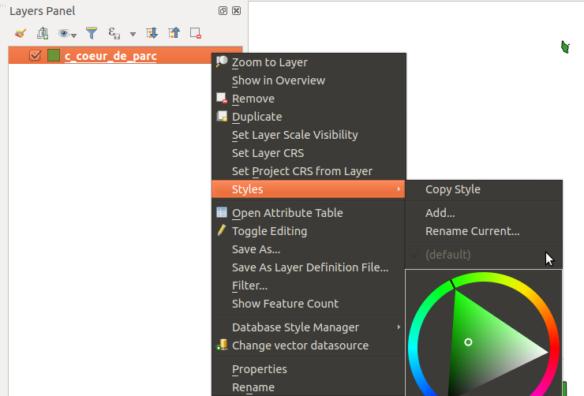
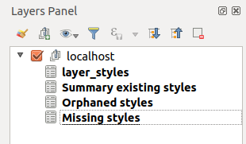
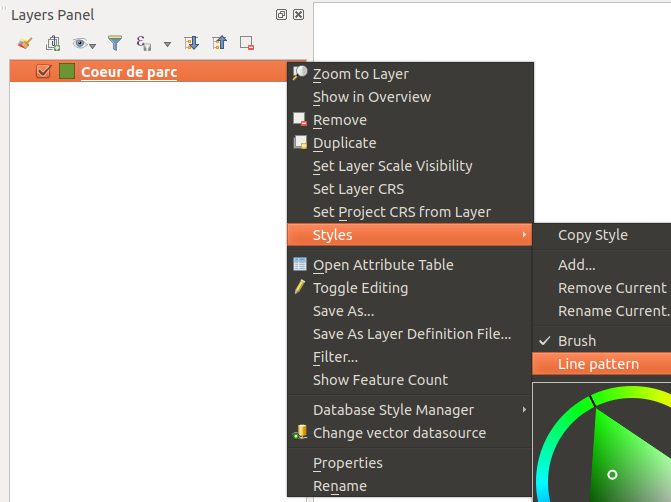
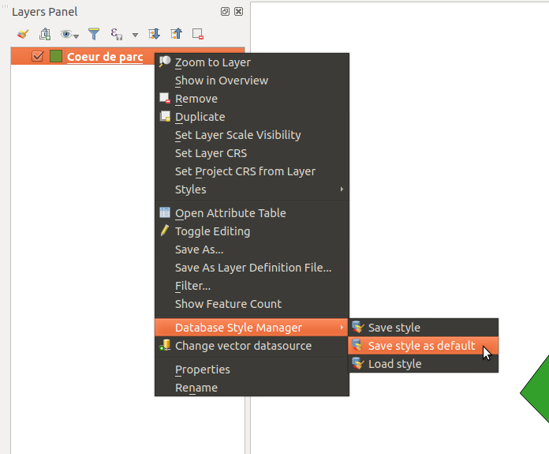

# Database style manager
This plugin allows you to synchronize styles contained in PostgreSQL with QGIS Desktop.

## By default, with QGIS Desktop, without the plugin

* You can store one or many styles for one layer in PostgreSQL.
* You can store one style as default for a layer.
* QGIS will automatically load the default style associated when the layer is added to the mapcanvas.
* To load all styles associated to a layer, you need to do it manually:
  * In the contextual menu of the layer, add a new style.
  * In layer properties, load new style from database.
  * Rename the style in QGIS to match the name in the database.
  * Do these steps for all styles. This is boring ;-)

Loading a PostgreSQL layer in QGIS:
* No style loaded in the layer menu
* No layer name in the legend. It's still the table name `c_coeur_de_parc`.

## With the plugin
* QGIS will load automatically all styles associated with the layer.
* This behavior can be enabled/disabled with the button in the toolbar. If you open a project, you may want to load styles in the project.
* The name of the style will be loaded too in the menu.
* The name will match in QGIS Desktop and Postgis.
* QGIS will save the layer name as description in the style table.
* ~~The name of the style description will be loaded as layer name in the legend.~~ Deactivated in 0.3 because with QGIS 2.18 we can't know which style is the default one.

### Style summary
* Since 0.3, the plugin can provide some summary about your styles.
The tool creates 4 layers in your legend. They are embedded in a group with the connection name.
  * layer_styles: the default layer made by QGIS to manage styles. This one is editable, use with cautious.
  * Summary existing styles: Count the number of style per unique layer in your database.
  * Orphaned styles: Styles which are stored in your DB but the layer does not exist anymore.
  * Missing styles: Layers which are your database but no style has been found in the QGIS style table.

Example
 
Loading a postgresql layer in QGIS:
* All styles are loaded with their names
* ~~Layer name is set:~~ `Coeur de parc`

* Menu to load all styles from postgis

## Todo
* Improve layer name (maybe QGIS 2.18.21 and QGIS 3.4.0)
* Delete styles for QGIS < 3.0